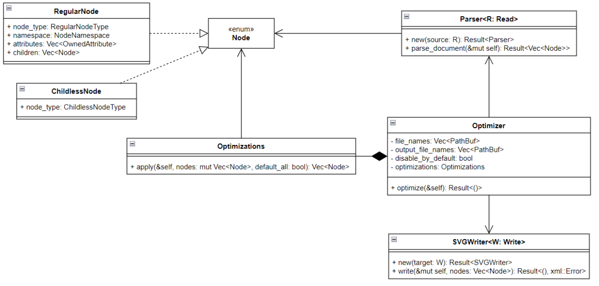

## ZPR 24Z - Narzędzie CLI do optymalizacji plików SVG

### Skład zespołu
- Jakub Proboszcz
- Paweł Kochański

## Oryginalny temat projektu

Celem projektu jest stworzenie aplikacji, która pozwala na optymalizację pliku `.svg` pod kątem rozmiaru. Referencyjnym przykładem takiej aplikacji jest [svgo](https://github.com/svg/svgo). Aplikacja powinna działać z poziomu konsoli (CLI).

## Opis architektury

Większość funkcjonalności naszej aplikacji zawarte jest w podkatalogu `optimizations`. Każdy plik w tym podkatalogu (poza `common.rs`) zawiera funkcję wykonującą jedną optymalizację.

## Zaimplementowana funkcjonalność

W ramach projektu zaimplementowaliśmy następujący podzbiór optymalizacji:
- zmiana nazw `id` na minimalnej długości, usuwanie niepotrzebnych
- usuwanie znaków nowej linii i nadmiarowych spacji z atrybutów
- zaokrąglanie liczb zmiennoprzecinkowych do określonej precyzji
- redukowanie niepotrzebnych grup
- konwertowanie elips będących kołami w koła
- łączenie transformacji w pojedynczą macierz
- łączenie ścieżek
- wyłączanie wspólnych atrybutów elementów grupy do atrybutów grupy
- usuwanie komentarzy
- usuwanie deklaracji `DOCTYPE`
- usuwanie elementów: `<desc>`, `<metadata>`, `<title>`, `<xml>`
- usuwanie przestrzeni nazw, elementów i atrybutów edytorów
- usuwanie pustych atrybutów
- usuwanie pustych kontenerów
- usuwanie pustych elementów `<text>`, `<tspan>`, `<tref>`
- usuwanie atrybutów `width` i `height` jeżeli `viewBox` ma takie same wartości
- usuwanie elementów oznaczonych jako niewidoczne
- usuwanie nieużywanych definicji
- usuwanie bezużytecznych atrybutów `stroke` i `fill`
- zamiana identycznych ścieżek na `<use>` tej samej ścieżki
- sortowanie atrybutów dla lepszej kompresji

## Ograniczenia projektu

Nie zaimplementowaliśmy następujących optymalizacji wymienionych w dokumentacji wstępnej:

- usuwanie `enable-background` w przypadku gdy odpowiada wymiarami wymiarom w tagu `svg` - atrybut `enable-background` nie jest wspierany w obecnym standardzie SVG.
- aplikowanie transformacji na ścieżki i usuwanie ścieżek rysowanych poza ekranem - struktura ścieżek w SVG jest dość skomplikowana, w związku z czym zabrakło nam czasu na zaimplementowanie tej optymalizacji.
- usuwanie nieużywanych przestrzeni nazw - funkcjonalność ta jest w większości pokryta przez "usuwanie przestrzeni nazw, elementów i atrybutów edytorów", jako że jedyną przestrzenią nazw pozostałą po wyżej wymienionej optymalizacji pozostaje "xlink".
- konwertowanie jednopunktowych gradientów w czysty kolor i łączenie styli - parsowanie CSS'a zawartego wewnątrz pliku SVG, jest zadaniem nietrywialnym i w związku z tym pominęliśmy optymalizacje tego wymagające.

Poza tym, ze względu na ograniczenia biblioteki `xml-rs` używanej przez nas do parsowania XML'a, nasz program zawsze usuwa instrukcję przetwarzania xml oraz tag DOCTYPE, zawarte poza głównym tagiem SVG. Z tego samego powodu, kolejność atrybutów oraz białe znaki pomiędzy nimi mogą się różnić w stosunku do oryginalnego pliku nawet, jeżeli wyłączone są wszystkie optymalizacje.

## Dokumentacja użytkownika

Dokumentacja użytkownika została zawarta w README.md.

## Dodatkowe informacje

Liczba linii kodu wynosi 4001. Liczba testów wynosi 63. Pokrycie kodu testami wynosi 91.28%. Liczba godzin poświęconych na projekt wynosi w sumie około 100.
